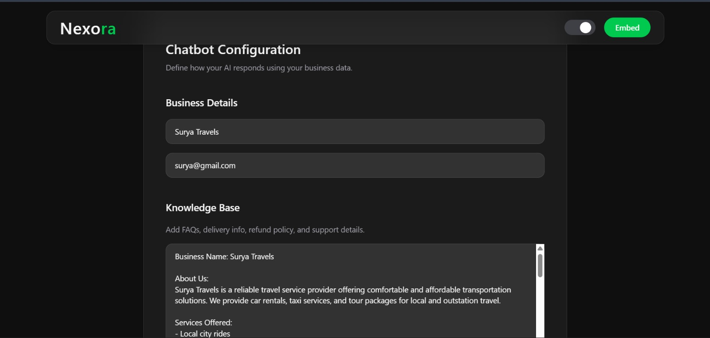
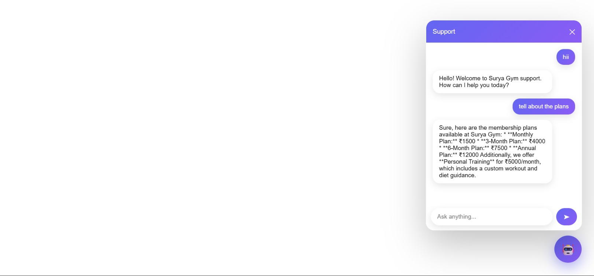
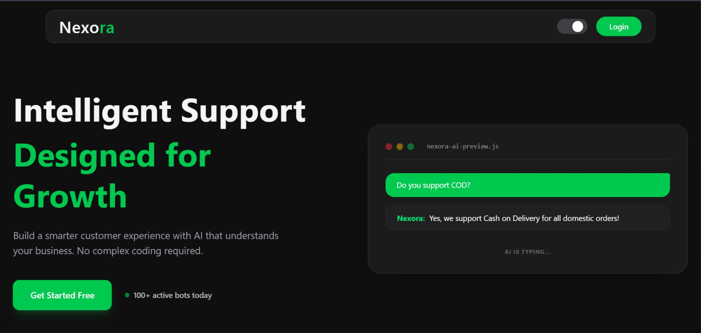
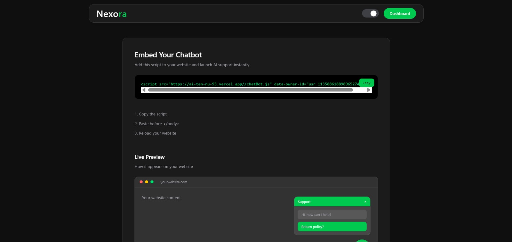

# 🤖 Nexora AI Chatbot

A customizable AI-powered chatbot that can be embedded into any website for customer support.

Built with modern UI, smooth UX, and real-time AI responses powered by your own knowledge base.

---

## 🚀 Features

* 💬 Floating chatbot widget (embed anywhere)
* 🎨 Modern glassmorphism UI
* ⚡ Fast API-based AI responses
* 🔒 Secure environment-based configuration
* 🧠 Custom knowledge base support
* 🌗 Dark / Light mode
* 🚫 Smart form validation + auto-save
* 🔌 Simple embed integration

---

## 🖥️ Screenshots

> 📁 Place images inside `/screenshots` folder

### 🔹 Dashboard



### 🔹 Chatbot UI



### 🔹 Home UI



### 🔹 Embed Page



---

## ⚙️ Installation

```bash
git clone https://github.com/your-username/your-repo-name.git
cd your-repo-name
npm install
npm run dev
```

---

## 🔑 Environment Variables

Create a `.env.local` file in the root directory:

```env
SCALEKIT_ENVIRONMENT_URL=your_scalekit_url
SCALEKIT_CLIENT_ID=your_client_id
SCALEKIT_CLIENT_SECRET=your_secret

NEXT_PUBLIC_APP_URL=http://localhost:3000

MONGODB_URI=your_mongodb_connection_string

GEMINI_API_KEY=your_gemini_api_key
```

> ⚠️ Never commit `.env.local` to GitHub

---

## 🧩 How It Works

1. Configure chatbot (business name, email, knowledge base)
2. Save settings securely
3. Generate embed script
4. Add script to any website
5. Chatbot responds using your data

---

## 🔌 Embed Script

Add this script to your website:

```html
<script src="http://localhost:3000/widget.js" data-owner-id="YOUR_ID"></script>
```

---

## 📂 Project Structure

```
/app
/components
/api
/lib
/model
/public
/screenshots
```

---

## 🛠️ Tech Stack

* Next.js
* React
* Tailwind CSS
* Framer Motion
* Axios
* MongoDB
* Node.js

---

## 📌 Future Improvements

* 🔊 Voice-based chatbot
* 🌐 Multi-language support
* 📊 Analytics dashboard
* 🤖 Advanced AI context memory

---

## 👨‍💻 Author

Surya

---

## ⭐ Support

If you like this project, give it a star ⭐

---

## 📸 Adding Screenshots (Quick Guide)

1. Create a folder:

```
screenshots
```

2. Add images:

```
dashboard.png
chatbot.png
embed.png
```

3. Done — GitHub will automatically display them.

---

## 🚨 Security Note

* Never upload `.env.local`
* Always use `.env.example` for sharing structure
* Rotate keys if exposed

---

## 🧠 Final Note

This is not just a chatbot —
it’s a **plug-and-play AI support system** for real businesses.

Build it. Improve it. Ship it 🚀
